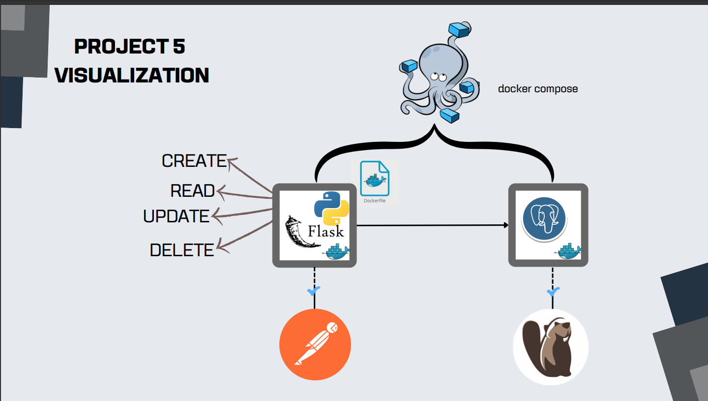

# SIB6-Project6_CRUD_API_FLASK

create CRUD API USING FLASK AND DOCKER



# TOOLS
- docker
- dbeaver
- postman

# STEPS
1. Create docker-compose.yamlto setting postgres and flask , then run docker-compose up -d
2. connect postgres database using dbeaver
3. if successful, run this script to make table
```
create sequence user_id_seq
	start with 1
	increment by 1
	no minvalue 
	no maxvalue;

create table public.users (
	user_id int4 not null default nextval('user_id_seq'::regclass),
	name varchar(100) null,
	city varchar(50) null,
	telp varchar(14) null,
	constraint users_pkey primary key (user_id)
);

```
4. install requirements.txt
5. create main.py to make the API
6. Create Dockerfile. Run `docker build -t project5 .`
7. Run `localhost:5000` to check if database have been successfully connected
8. test the API using postman. DO the methods GET, POST, PUT, DELETE.
9. check the dbeaver if the data also be saved in local postgres
